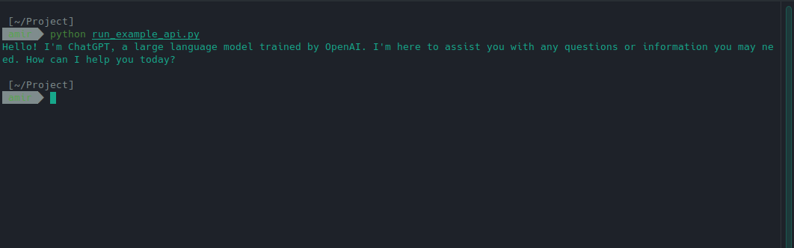

### revChatGPT Flask API
Web API for revChatGPT via Flask.
<br><br><br>

__Note__: First, you need to configure [revChatGPT](https://github.com/acheong08/ChatGPT) with either a user account or a session token.
<br>

#### Screenshot


<br><br>
### How to use
##### Example Python Script:
```
import requests
import json

url = "http://127.0.0.1:5000/chat"
payload = {
    "session_id": "test_session",
    "prompt": "Hi, Who are you?"
}

response = requests.post(url, json=payload)

if response.ok:
    result = response.json()
    print(result["response"])
else:
    print("Error:", response.status_code, response.text)
```
